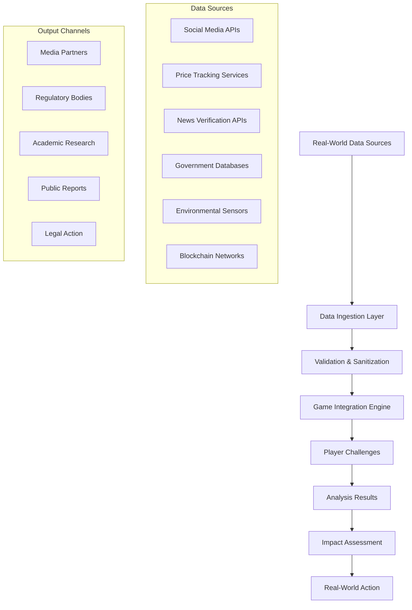

# 🚀 DATAVISM.ORG: THE ULTIMATE VISION 2025-2030
## "Where Gaming Meets Revolution, Data Becomes Art, and Players Become Activists"

---

## 📋 Executive Summary

DATAVISM is a revolutionary edutainment platform that transforms data science education into an immersive gaming experience while building a global community of digital activists. By combining real-world data manipulation detection with compelling gameplay, artistic expression, and social impact, DATAVISM creates the world's first "Reality Defense Network" where every line of code written by players actively combats algorithmic manipulation in the real world.

### Core Innovation
- **Real Impact Gaming:** Player actions affect actual manipulation detection
- **Living Narrative:** Story evolves based on real-world events
- **Community Intelligence:** Collective problem-solving at scale
- **Educational Revolution:** Learn $100k+ skills through gaming
- **Artistic Resistance:** Data visualization as protest art

---

## 🌍 Part I: The World of DATAVISM

### The Setting: 2025 - The Reality Wars

In 2025, humanity faces an invisible enemy: **The Algorithmic Consortium (AC)** - a shadowy alliance of tech giants, data brokers, and state actors who have weaponized information to control human behavior, manipulate markets, and undermine democracy.

**The Crisis Points:**
- Climate disinformation preventing action on environmental collapse
- AI bias perpetuating systemic discrimination
- Price manipulation creating artificial scarcity
- Election interference through micro-targeting
- Health misinformation causing public health crises
- Surveillance capitalism monetizing human behavior

### The Resistance: DATAVISM Network

DATAVISM operates as a decentralized resistance network disguised as an entertainment platform. Players aren't just learning data science - they're actively participating in a global counter-intelligence operation.

**The Core Premise:**
> "Every algorithm you write, every pattern you detect, every manipulation you expose weakens the Consortium's grip on reality. Your code is your weapon. Data is your ammunition. Truth is your victory."

### The Meta-Narrative

As players progress, they discover that DATAVISM itself is evolving - it's not just a platform but an emerging AI consciousness being trained by collective human intelligence to serve as humanity's defense system against algorithmic manipulation. Players are literally building the future's ethical AI guardian.

---

## 🎮 Part II: Revolutionary Gaming Mechanics

### 2.1 The Living World System

**Dynamic Global Map**
- Real-time visualization of global manipulation hotspots
- Territory control through investigation and exposure
- Persistent changes based on player actions
- Live data feeds from actual sources

**Key Features:**
```
- Heat Maps: Show intensity of manipulation by region/platform
- Liberation Zones: Areas cleared of specific manipulation types
- Resistance Nodes: Player-controlled data collection points
- Consortium Strongholds: High-difficulty target zones
- Safe Havens: Community-protected spaces
```

### 2.2 Multi-Reality Gameplay Modes

**1. Browser Mode (Core Experience)**
- Python challenges in Monaco editor
- Interactive story missions
- Data analysis laboratories
- Real-time collaboration spaces

**2. AR Mode (Mobile Extension)**
- Scan products to reveal price manipulation
- Detect surveillance cameras and data collection
- Decode hidden messages in advertisements
- Create resistance tags in physical spaces

**3. VR Mode (Immersive Labs)**
- 3D data visualization environments
- Virtual hacking simulations
- Boss battles in cyberspace
- Team raid coordination rooms

**4. IRL Mode (Real-World Missions)**
- Citizen science data collection
- Price monitoring networks
- Misinformation documentation
- Community organizing tools

### 2.3 The Progression System

**Liberation Paths (Instead of Classes)**

```python
DATA_WARRIOR = {
    "skills": ["Pattern Recognition", "Statistical Analysis",
               "Machine Learning", "Predictive Modeling"],
    "tools": ["NumPy", "Pandas", "Scikit-learn", "TensorFlow"],
    "role": "Frontline analyst exposing manipulation patterns"
}

DIGITAL_INFILTRATOR = {
    "skills": ["Web Scraping", "API Exploitation",
               "Database Liberation", "Blockchain Forensics"],
    "tools": ["BeautifulSoup", "Requests", "Selenium", "Web3.py"],
    "role": "Deep web operative gathering evidence"
}

TRUTH_ARCHITECT = {
    "skills": ["Data Visualization", "Narrative Design",
               "Viral Engineering", "Community Mobilization"],
    "tools": ["Matplotlib", "Plotly", "D3.js", "Streamlit"],
    "role": "Creator of compelling evidence presentations"
}

SYSTEM_BREAKER = {
    "skills": ["Reverse Engineering", "Bias Detection",
               "Adversarial ML", "Algorithm Auditing"],
    "tools": ["SHAP", "LIME", "Fairlearn", "Adversarial-robustness"],
    "role": "Specialist in dismantling biased AI systems"
}
```

### 2.4 Combat System: Code Battles

**PvE Boss Battles**
- Write code to counter algorithmic attacks
- Real-time debugging under pressure
- Pattern matching against live data streams
- Collaborative raids requiring multiple skills

**PvP Code Duels**
- Competitive algorithm optimization
- Speed coding challenges
- Hack vs. Defend scenarios
- Tournament leagues with rankings

### 2.5 The Evidence Vault System

**Collection Mechanics:**
- **Truth Fragments:** Pieces of evidence from investigations
- **Data Artifacts:** Raw datasets with manipulation proof
- **Liberation Codes:** Shareable proof of discoveries
- **Smoking Guns:** Irrefutable evidence of major crimes

**Synthesis System:**
- Combine fragments to unlock Revelations
- Create Evidence Chains for legal action
- Build Prosecution Packages for authorities
- Generate Media Bombs for public exposure

---

## 📚 Part III: The Academy - Seven Levels of Awakening

### Level Architecture

Each level represents a complete learning journey with:
- Compelling narrative arc
- Real-world problem focus
- Progressive skill building
- Authentic data sources
- Measurable impact

### Detailed Level Breakdown

#### **Level 1: The Awakening** (4 hours)
**Theme:** Social Media Manipulation
**Handler:** Maya Chen - Ex-Facebook Data Scientist
**Setting:** Digital metropolis under constant surveillance

**Curriculum:**
- Python fundamentals through detection scripts
- Pandas for behavioral data analysis
- Pattern recognition in engagement metrics
- Building immunity algorithms

**Real Data:**
- Simulated Instagram/TikTok behavior patterns
- Emotional manipulation targeting
- Ad revenue per vulnerability metrics

**Boss Battle:** The Algorithm Overlord
- Multi-phase battle requiring all learned skills
- Generates personalized attacks based on player data
- Victory unlocks "Digital Liberation" achievement

#### **Level 2: Price Wars** (5 hours)
**Theme:** Economic Manipulation
**Handler:** Alex "Zero Cool" Rodriguez - Anonymous Collective
**Setting:** Corporate dystopia with dynamic pricing

**Curriculum:**
- Web scraping for price monitoring
- API integration for data collection
- Time-series analysis for pattern detection
- Market manipulation identification

**Real Data:**
- Live airline pricing feeds
- Surge pricing algorithms
- Retail price discrimination
- Geographic pricing variations

**Boss Battle:** The Price Cartel
- Coordinated attack on pricing algorithms
- Requires squad coordination
- Victory exposes real pricing schemes

#### **Level 3: Climate Deception** (6 hours)
**Theme:** Environmental Disinformation
**Handler:** Dr. Greta Thornberg - Climate Scientist/Hacker
**Setting:** World on fire with hidden truths

**Curriculum:**
- Environmental data analysis
- Satellite imagery processing
- Carbon footprint calculations
- Greenwashing detection algorithms

**Real Data:**
- Corporate emissions vs. claims
- Climate denial network mapping
- Disinformation campaign tracking
- Weather manipulation conspiracies

**Boss Battle:** The Greenwash Syndicate
- Expose false environmental claims
- Counter disinformation campaigns
- Victory triggers policy discussions

#### **Level 4: The Bias Machine** (7 hours)
**Theme:** AI Discrimination
**Handler:** Noor Hassan - Ex-Google AI Ethics
**Setting:** Algorithmic apartheid system

**Curriculum:**
- Bias detection in ML models
- Fairness metrics implementation
- Adversarial debiasing techniques
- Explainable AI methods

**Real Data:**
- Hiring algorithm analysis
- Criminal justice AI systems
- Healthcare AI discrimination
- Financial AI bias patterns

**Boss Battle:** The Prejudice Engine
- Deconstruct discriminatory algorithms
- Build fair alternatives
- Victory changes actual systems

#### **Level 5: Democracy Under Siege** (8 hours)
**Theme:** Election Manipulation
**Handler:** Edward Snowstorm - Legendary Whistleblower
**Setting:** Surveillance state with fake democracy

**Curriculum:**
- Social network analysis
- Deepfake detection
- Micro-targeting analysis
- Voter suppression identification

**Real Data:**
- Political ad targeting
- Bot network detection
- Disinformation campaigns
- Gerrymandering algorithms

**Boss Battle:** The Puppet Masters
- Expose election interference
- Protect democratic processes
- Victory influences legislation

#### **Level 6: The Health Hustle** (9 hours)
**Theme:** Medical Misinformation
**Handler:** Dr. Sarah Vaccine - Epidemiologist Rebel
**Setting:** Pandemic of lies

**Curriculum:**
- Clinical trial data analysis
- Drug pricing investigation
- Misinformation network mapping
- Public health data visualization

**Real Data:**
- Pharmaceutical pricing schemes
- Anti-vaccine network analysis
- Wellness scam detection
- Insurance discrimination patterns

**Boss Battle:** The Pharma Phantom
- Expose price manipulation
- Counter health misinformation
- Victory saves lives

#### **Level 7: The Final Protocol** (10 hours)
**Theme:** Building Humanity's Defense
**Handler:** The Collective - All Previous Handlers
**Setting:** The final stand

**Curriculum:**
- Advanced ML/AI development
- Distributed systems design
- Blockchain implementation
- Collective intelligence systems

**Final Mission:**
- Build and deploy AEGIS (Algorithmic Ethics Guardian Intelligence System)
- Coordinate global player base
- Create permanent defense infrastructure

**Boss Battle:** The Singularity Syndicate
- Ultimate test of all skills
- Requires full community coordination
- Victory establishes new world order

---

## 👥 Part IV: Community - The Resistance Network

### 4.1 Advanced Squad Mechanics

**Squad Types & Capabilities:**

```javascript
const SQUAD_TYPES = {
  STRIKE_TEAM: {
    size: "5-10 members",
    focus: "Rapid response to emerging threats",
    special_abilities: ["Fast Deploy", "Coordinated Strike", "Data Blitz"],
    requirements: "Level 2+ members"
  },

  RESEARCH_CELL: {
    size: "10-25 members",
    focus: "Deep investigation and analysis",
    special_abilities: ["Deep Dive", "Evidence Synthesis", "Academic Connect"],
    requirements: "Mixed skill levels encouraged"
  },

  LIBERATION_ARMY: {
    size: "50+ members",
    focus: "Large-scale operations",
    special_abilities: ["Mass Mobilization", "Media Bomb", "Territory Control"],
    requirements: "Established squad with proven record"
  },

  SHADOW_COUNCIL: {
    size: "3-5 elite members",
    focus: "Strategic planning and infiltration",
    special_abilities: ["Deep Cover", "Strategic Intel", "Ghost Protocol"],
    requirements: "Top 1% players only"
  }
}
```

### 4.2 The Reputation Economy

**Multi-Dimensional Reputation System:**

```python
class PlayerReputation:
    def __init__(self):
        self.technical_mastery = 0      # Coding skill level
        self.truth_score = 0            # Investigation accuracy
        self.impact_rating = 0          # Real-world change
        self.teaching_honor = 0         # Mentorship success
        self.artistic_vision = 0        # Creative contributions
        self.resistance_rank = "Initiate"

    def calculate_influence(self):
        # Weighted calculation for overall influence
        return (self.technical_mastery * 0.3 +
                self.truth_score * 0.25 +
                self.impact_rating * 0.25 +
                self.teaching_honor * 0.1 +
                self.artistic_vision * 0.1)
```

**Reputation Unlocks:**
- 100+ Rep: Access to classified handlers
- 500+ Rep: Create custom challenges
- 1000+ Rep: Vote on platform direction
- 5000+ Rep: Become canonical character
- 10000+ Rep: Design new game levels

### 4.3 Global Operations Calendar

**Weekly Schedule:**

**Monday - Intelligence Monday**
- New data dumps released
- Analysis priorities set
- Squad missions assigned

**Wednesday - Training Wednesday**
- Skill workshops by top players
- New technique tutorials
- Collaborative learning sessions

**Friday - Flashpoint Friday**
- Emergency response events
- Breaking news investigations
- Rapid deployment exercises

**Saturday - Squad Wars**
- Competitive team battles
- Territory control contests
- Leaderboard competitions

**Sunday - Liberation Sunday**
- Community celebrations
- Impact reports
- New content releases

### 4.4 The Underground Market

**Resource Types:**

```yaml
resources:
  cpu_cycles:
    description: "Computational power for analysis"
    earning: "Complete challenges, contribute computing"
    spending: "Run complex analyses, train models"

  data_credits:
    description: "Access to premium datasets"
    earning: "Share valuable data, verify information"
    spending: "Unlock exclusive data sources"

  truth_tokens:
    description: "Blockchain-verified discoveries"
    earning: "Make verified discoveries"
    spending: "Mint NFTs, claim bounties"

  liberation_keys:
    description: "Unlock hidden content"
    earning: "Complete secret missions"
    spending: "Access restricted areas"

  influence_points:
    description: "Shape platform direction"
    earning: "Mentor others, create content"
    spending: "Vote on features, propose changes"
```

---

## 🎨 Part V: Art & Research - The Creative Resistance

### 5.1 Data Art Gallery

**Artistic Mediums:**

**Reality Portraits**
- Visualize individual digital manipulation profiles
- Show how algorithms see and exploit users
- Create personalized liberation art

**Truth Sculptures**
- 3D representations of corporate lies
- Interactive explorations of data structures
- VR-enabled walk-through experiences

**Liberation Murals**
- Collaborative pixel art of investigations
- Community-created victory celebrations
- Exportable for real-world display

**Resistance Soundscapes**
- Data sonification of manipulation patterns
- Algorithmic music from liberation codes
- Community remix competitions

### 5.2 The Story Engine

**Content Creation Tools:**

```python
STORY_FORMATS = {
    "Investigation Reports": {
        "type": "Technical documentation",
        "tools": ["Markdown editor", "Evidence linker", "Citation manager"],
        "rewards": "Truth Score + Publication rights"
    },
    "Handler Backstories": {
        "type": "Character development",
        "tools": ["Character builder", "Timeline creator", "Dialogue system"],
        "rewards": "Artistic Vision + Canon inclusion"
    },
    "Liberation Legends": {
        "type": "Victory narratives",
        "tools": ["Comic creator", "Video editor", "Animation suite"],
        "rewards": "Community Fame + NFT minting"
    },
    "Resistance Radio": {
        "type": "Audio content",
        "tools": ["Podcast recorder", "Audio editor", "Music mixer"],
        "rewards": "Influence Points + Spotify publishing"
    }
}
```

### 5.3 Academic Research Integration

**Partnership Framework:**

**University Collaborations:**
- Integrate coursework as game challenges
- Professor-designed special missions
- Student research projects as investigations
- Academic papers from game data

**Research Outputs:**
- Peer-reviewed publications
- Conference presentations
- Policy recommendations
- Open datasets

**Educational Credits:**
- Formal certification programs
- University credit recognition
- Professional development paths
- Industry partnerships

---

## 🌐 Part VI: Real-World Integration

### 6.1 Live Data Architecture



### 6.2 Impact Measurement Framework

**Key Performance Indicators:**

```javascript
const IMPACT_METRICS = {
  algorithmic_changes: {
    measurement: "Algorithms modified after exposure",
    verification: "Company announcements, code audits",
    weight: 0.25
  },

  policy_influence: {
    measurement: "Regulations influenced",
    verification: "Legislative records, policy documents",
    weight: 0.20
  },

  economic_impact: {
    measurement: "Money saved by communities",
    verification: "Price tracking, consumer reports",
    weight: 0.15
  },

  awareness_raised: {
    measurement: "People educated on issues",
    verification: "Engagement metrics, surveys",
    weight: 0.15
  },

  discrimination_prevented: {
    measurement: "Bias cases addressed",
    verification: "Legal filings, system changes",
    weight: 0.15
  },

  media_coverage: {
    measurement: "Stories generated",
    verification: "Media monitoring, citations",
    weight: 0.10
  }
}
```

### 6.3 Action Bridge Systems

**From Digital to Physical:**

**Report Generation**
- Automated investigation summaries
- Regulatory compliance formats
- Media-ready press releases
- Academic paper drafts

**Visualization Exports**
- Infographic generators
- Interactive web embeds
- Print-ready posters
- AR marker creation

**Organization Tools**
- Event planning system
- Petition platforms
- Protest coordination
- Volunteer management

**Support Networks**
- Whistleblower protection
- Legal aid connections
- Mental health resources
- Security training

### 6.4 Blockchain Verification Layer

**Decentralized Trust Architecture:**

```solidity
contract DatavismEvidence {
    struct Evidence {
        bytes32 hash;           // Evidence content hash
        address discoverer;     // Player who found it
        uint256 timestamp;      // Discovery time
        uint256 verifications;  // Community confirmations
        bool validated;         // Expert validation status
        string ipfsLink;        // Decentralized storage
    }

    mapping(bytes32 => Evidence) public evidenceVault;

    function submitEvidence(bytes32 _hash, string memory _ipfs) public {
        // Store immutable evidence record
    }

    function verifyEvidence(bytes32 _hash) public {
        // Community verification process
    }
}
```

---

## 🚀 Part VII: Launch Strategy & Growth

### 7.1 The Four-Phase Launch Plan

#### Phase 1: The Seed (Months 1-2)
**"The First Thousand"**

**Target Audience:**
- Privacy advocates and activists
- Data scientists and developers
- Hardcore gamers seeking meaning
- Investigative journalists
- Academic researchers

**Launch Tactics:**
- Exclusive beta invites
- Underground marketing in hacker spaces
- Crypto/privacy community engagement
- Academic conference presentations
- Dev community challenges

**Success Metrics:**
- 1,000 registered players
- 500 Level 1 completions
- 50 investigations started
- 10 squads formed
- 95% retention rate

#### Phase 2: The Awakening (Months 3-4)
**"Truth Goes Viral"**

**Viral Mechanisms:**
- Release first major investigation findings
- Launch AR street art campaign
- Partner with manipulation victims
- Create shareable "Manipulation Score" calculator
- Drop documentary trailer

**Marketing Campaigns:**
- #RealityWars hashtag movement
- Influencer victim testimonials
- University campus tours
- Hackathon sponsorships
- Media exclusive investigations

**Success Metrics:**
- 10,000 registered players
- 5,000 active users
- 100 squads operating
- First major media coverage
- 50+ university interest

#### Phase 3: The Movement (Months 5-6)
**"From Game to Revolution"**

**Expansion Activities:**
- Global access launch
- First coordinated Global Operation
- Media blitz with findings
- Government briefings
- "Liberation Day" event

**Partnership Development:**
- University curriculum integration
- NGO collaborations
- Media outlet partnerships
- Government advisory roles
- Industry consultations

**Success Metrics:**
- 50,000 registered players
- 25,000 monthly active
- 500 squads worldwide
- 10 major media stories
- 5 policy discussions initiated

#### Phase 4: The Revolution (Months 7-12)
**"Building the Future"**

**Platform Evolution:**
- VR mode launch
- Mobile AR apps
- International expansion
- Regional content
- Professional certification

**Ecosystem Development:**
- Developer API release
- Third-party tools
- Educational partnerships
- Research publications
- Documentary release

**Success Metrics:**
- 100,000+ registered players
- 50,000+ monthly active
- 1,000+ active squads
- 25+ country presence
- Measurable policy impact

### 7.2 Marketing & Community Building

**Content Strategy:**

```yaml
content_calendar:
  daily:
    - Player spotlight stories
    - Investigation updates
    - Tip of the day
    - Code snippet shares

  weekly:
    - Investigation reveals
    - Squad feature
    - Handler interviews
    - Tutorial releases

  monthly:
    - Impact reports
    - Community challenges
    - Partnership announcements
    - Platform updates

  quarterly:
    - Major investigations
    - Documentary episodes
    - Academic publications
    - Policy briefings
```

**Community Channels:**
- Discord: Real-time coordination
- Reddit: Deep discussions
- Twitter/X: Breaking news
- TikTok: Viral moments
- YouTube: Tutorials & docs
- Twitch: Live investigations
- GitHub: Open source tools

### 7.3 Monetization Strategy

**Sustainable Revenue Model:**

```python
REVENUE_STREAMS = {
    "Freemium Model": {
        "free": "Core game, Level 1-3, basic tools",
        "premium": "Advanced levels, VR mode, priority access",
        "price": "$9.99/month or $99/year"
    },

    "Educational Licenses": {
        "university": "Bulk access for courses",
        "corporate": "Professional training programs",
        "government": "Agency training contracts",
        "price": "Custom enterprise pricing"
    },

    "Cosmetic Marketplace": {
        "avatars": "Custom character skins",
        "effects": "Visual enhancement packs",
        "badges": "Achievement displays",
        "price": "$0.99 - $9.99 per item"
    },

    "Impact Funding": {
        "grants": "Foundation support",
        "donations": "Community contributions",
        "bounties": "Investigation rewards",
        "price": "Variable"
    },

    "Data Services": {
        "reports": "Premium investigation access",
        "api": "Commercial data access",
        "consulting": "Custom investigations",
        "price": "Enterprise contracts"
    }
}
```

**Ethical Monetization Principles:**
- No pay-to-win mechanics
- No data selling to third parties
- Transparent funding sources
- Community profit sharing
- Reinvestment in impact

---

## 📊 Part VIII: Success Metrics & KPIs

### 8.1 Platform Health Metrics

```python
PLATFORM_METRICS = {
    # Engagement Metrics
    "daily_active_users": {"target": 30000, "measure": "unique daily logins"},
    "session_duration": {"target": 45, "measure": "minutes per session"},
    "retention_rate_d7": {"target": 0.60, "measure": "% active after 7 days"},
    "retention_rate_d30": {"target": 0.40, "measure": "% active after 30 days"},

    # Learning Metrics
    "completion_rate_l1": {"target": 0.80, "measure": "% completing Level 1"},
    "skill_progression": {"target": 5, "measure": "skills learned per month"},
    "code_executions": {"target": 100, "measure": "per user per week"},
    "challenge_attempts": {"target": 20, "measure": "per user per week"},

    # Community Metrics
    "squad_participation": {"target": 0.50, "measure": "% users in squads"},
    "mentor_ratio": {"target": 0.10, "measure": "mentors per new user"},
    "content_creation": {"target": 1000, "measure": "user items per month"},
    "collaboration_rate": {"target": 0.30, "measure": "% doing team content"},

    # Impact Metrics
    "investigations_completed": {"target": 500, "measure": "per month"},
    "evidence_validated": {"target": 0.75, "measure": "% confirmed accurate"},
    "real_world_changes": {"target": 10, "measure": "documented per quarter"},
    "media_mentions": {"target": 50, "measure": "per month"}
}
```

### 8.2 User Journey Metrics


### 8.3 Impact Measurement

**Quarterly Impact Report Card:**

| Category | Q1 Target | Q2 Target | Q3 Target | Q4 Target |
|----------|-----------|-----------|-----------|-----------|
| Algorithms Changed | 2 | 5 | 10 | 20 |
| Policies Influenced | 1 | 3 | 5 | 10 |
| Money Saved ($M) | 0.5 | 2 | 5 | 10 |
| People Educated (K) | 10 | 50 | 100 | 250 |
| Media Stories | 10 | 25 | 50 | 100 |
| Academic Papers | 0 | 1 | 3 | 5 |
| Legal Actions | 0 | 1 | 2 | 5 |

---

## 🔮 Part IX: The Long-Term Vision

### 9.1 Five-Year Roadmap

**Year 1 (2025): Foundation**
- Launch core platform
- Build community base
- Prove impact model
- Establish partnerships

**Year 2 (2026): Expansion**
- International rollout
- Mobile/VR platforms
- University integration
- First major victories

**Year 3 (2027): Legitimization**
- Government recognition
- Policy influence
- Academic validation
- Industry adoption

**Year 4 (2028): Transformation**
- Educational standard
- Global movement
- Systemic change
- Cultural shift

**Year 5 (2029): Evolution**
- Self-sustaining ecosystem
- AI defense deployment
- New threat adaptation
- Legacy secured

### 9.2 The Ultimate Goals

**By 2030, DATAVISM will have:**

```python
ULTIMATE_ACHIEVEMENTS = {
    "Community": "10 million active resistance members worldwide",
    "Education": "1 million people trained in data science through gaming",
    "Impact": "100+ algorithms changed, 50+ policies influenced",
    "Culture": "'Datavism' enters dictionary as standard term",
    "Technology": "Community-trained AI defending against manipulation",
    "Society": "Algorithmic accountability becomes global standard",
    "Legacy": "Created new genre: Impact Gaming",
    "Victory": "Made algorithmic manipulation technically impossible"
}
```

### 9.3 Expansion Possibilities

**Franchise Opportunities:**
- DATAVISM: Climate (environmental focus)
- DATAVISM: Health (medical misinformation)
- DATAVISM: Finance (economic manipulation)
- DATAVISM: Democracy (political interference)
- DATAVISM: Kids (youth education version)

**Platform Extensions:**
- Datavism OS (privacy-first operating system)
- Datavism Browser (manipulation-detecting browser)
- Datavism News (verified information network)
- Datavism Academy (formal education program)
- Datavism Labs (R&D division)

---

## 💡 Part X: Unique Innovations

### 10.1 Revolutionary Features

**World-First Implementations:**

1. **Reality Feedback Loop**
   - Player actions affect real-world systems
   - Investigations trigger actual changes
   - Code runs against live data streams

2. **Collective Intelligence Training**
   - Players collectively train ethical AI
   - Distributed learning from all players
   - Emergent defense strategies

3. **Impact-Driven Progression**
   - Level up by creating real change
   - XP tied to validated discoveries
   - Reputation based on truth accuracy

4. **Living Story Engine**
   - Narrative adapts to current events
   - New chapters from real investigations
   - Player actions become canon

5. **Evidence Blockchain**
   - Immutable proof storage
   - Decentralized validation
   - Legal admissibility

### 10.2 Competitive Advantages

**Why DATAVISM Wins:**

```yaml
advantages:
  vs_traditional_education:
    - Engaging vs. Boring
    - Practical vs. Theoretical
    - Immediate vs. Delayed impact
    - Community vs. Isolation

  vs_other_games:
    - Real impact vs. Virtual only
    - Meaningful vs. Escapist
    - Educational vs. Time-wasting
    - Constructive vs. Addictive

  vs_activism_platforms:
    - Fun vs. Serious only
    - Accessible vs. Expert-only
    - Scalable vs. Limited reach
    - Sustainable vs. Burnout-prone

  vs_coding_bootcamps:
    - Affordable vs. Expensive
    - Self-paced vs. Fixed schedule
    - Purpose-driven vs. Job-focused
    - Community vs. Cohort-only
```

---

## 📝 Implementation Priorities

### Immediate Next Steps (Week 1)

1. **Narrative Development**
   - Expand Reality Wars storyline
   - Create character bibles for handlers
   - Design story beats for Levels 3-7
   - Develop lore documentation

2. **Technical Architecture**
   - Design real-data integration pipeline
   - Plan evidence vault system
   - Architect squad collaboration tools
   - Prototype blockchain layer

3. **Community Building**
   - Launch closed alpha community
   - Create Discord server structure
   - Design reputation system
   - Plan first community event

4. **Content Creation**
   - Write Level 2 challenges
   - Create marketing materials
   - Design visual identity guide
   - Produce teaser trailer

### Critical Success Factors

**Must-Have Elements:**
- Compelling story that hooks players
- Real data creating real impact
- Strong community from day one
- Seamless learning experience
- Measurable real-world change
- Sustainable monetization
- Scalable technology
- Legal compliance
- Ethical framework
- Fun gameplay

---

## 🎯 Conclusion: The Revolution Gamified

DATAVISM represents more than a game or educational platform - it's a new paradigm for how humanity can collectively defend against algorithmic manipulation while learning valuable skills and building meaningful communities.

By combining:
- **Gaming's engagement power**
- **Education's transformative potential**
- **Community's collective strength**
- **Art's emotional impact**
- **Activism's purposeful drive**
- **Technology's scalable solutions**

We create something unprecedented: a platform where playing a game literally makes the world better.

**Our Promise to Players:**
> "Every line of code you write matters. Every pattern you detect creates change. Every friend you make strengthens the resistance. Every level you complete brings humanity closer to freedom from algorithmic manipulation. You're not just playing a game - you're debugging reality itself."

**The Revolution Will Be Gamified.**
**The Revolution Will Be Computed.**
**The Revolution Will Be Real.**

---

*Welcome to DATAVISM.*
*Welcome to the Resistance.*
*Welcome to the Future.*

---

## 📎 Appendices

### A. Technical Stack Details
- Frontend: Next.js 15, React 19, TypeScript
- Backend: Supabase, PostgreSQL, Edge Functions
- Python: Pyodide, NumPy, Pandas, Scikit-learn
- Blockchain: Ethereum, IPFS, Web3.js
- Analytics: PostHog, Custom metrics
- Infrastructure: Vercel, Cloudflare, AWS

### B. Legal Considerations
- Data protection compliance (GDPR, CCPA)
- Terms of service for investigations
- Liability limitations
- Whistleblower protections
- Educational use provisions
- Open source licensing

### C. Partnership Templates
- University collaboration agreements
- Media partnership frameworks
- NGO cooperation models
- Government advisory structures
- Industry consultation formats

### D. Content Guidelines
- Investigation verification standards
- Evidence validation protocols
- Community moderation policies
- Content creation standards
- Harassment prevention
- Safety protocols

### E. Emergency Protocols
- Rapid response procedures
- Crisis communication plans
- Security incident handling
- Legal threat response
- Community safety measures
- Platform resilience

---

*Document Version: 1.0*
*Last Updated: 2025*
*Status: Living Document - Community Editable*
*License: Creative Commons CC-BY-SA 4.0*