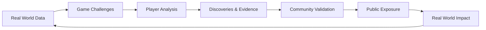

# 🌐 REAL-WORLD DATA INTEGRATION STRATEGY
## Connecting the Game to Reality

---

## 📋 Executive Summary

This document outlines how DATAVISM bridges the gap between gaming and reality by integrating live data sources, creating measurable impact, and transforming player discoveries into real-world change. This is not simulation - this is actual data activism gamified.

**Core Principle:** Every dataset in DATAVISM has a real-world counterpart. Every discovery can lead to actual change. Every investigation matters beyond the game.

---

## 🎯 Part I: Integration Philosophy

### The Reality Feedback Loop



### Core Principles

1. **Authenticity First**
   - Use real data whenever possible
   - Realistic simulations when real data unavailable
   - Transparent about data sources
   - Regular updates to reflect current reality

2. **Privacy Protection**
   - Never expose individual privacy
   - Aggregate data only
   - Anonymization as standard
   - GDPR/CCPA compliant

3. **Actionable Insights**
   - Every discovery can lead to action
   - Clear path from game to reality
   - Support for real-world campaigns
   - Partnership with advocacy groups

4. **Scientific Rigor**
   - Peer-reviewable methodology
   - Reproducible results
   - Documented limitations
   - Academic partnerships

---

## 📊 Part II: Data Source Architecture

### 2.1 Data Categories

```typescript
interface DataSources {
  // Level 1: Social Media Manipulation
  socialMedia: {
    platforms: ["Twitter API", "Reddit API", "Meta transparency"],
    dataTypes: ["Engagement patterns", "Ad targeting", "Trending topics"],
    refreshRate: "Real-time",
    privacy: "Anonymized aggregates"
  },

  // Level 2: Price Manipulation
  pricing: {
    platforms: ["Google Flights", "Amazon", "Uber API"],
    dataTypes: ["Dynamic pricing", "Price discrimination", "Surge patterns"],
    refreshRate: "Hourly",
    privacy: "No personal data"
  },

  // Level 3: Climate Disinformation
  climate: {
    platforms: ["NASA APIs", "NOAA", "CrowdTangle"],
    dataTypes: ["Climate data", "Disinformation tracking", "Corporate emissions"],
    refreshRate: "Daily",
    privacy: "Public data only"
  },

  // Level 4: AI Bias
  aiBias: {
    platforms: ["Hugging Face", "Model Cards", "Audit studies"],
    dataTypes: ["Model predictions", "Fairness metrics", "Discrimination patterns"],
    refreshRate: "Weekly",
    privacy: "Synthetic test data"
  },

  // Level 5: Election Integrity
  elections: {
    platforms: ["FEC data", "Ad libraries", "Fact-checkers"],
    dataTypes: ["Political ads", "Microtargeting", "Disinformation"],
    refreshRate: "Real-time during elections",
    privacy: "Public records only"
  },

  // Level 6: Health Misinformation
  health: {
    platforms: ["PubMed", "FDA", "Health feedback"],
    dataTypes: ["Drug pricing", "Clinical trials", "Misinformation tracking"],
    refreshRate: "Weekly",
    privacy: "Public health data"
  }
}
```

### 2.2 Data Pipeline Architecture

```python
class DataPipeline:
    """
    ETL pipeline for real-world data integration
    """

    def __init__(self):
        self.sources = self.initialize_sources()
        self.storage = SupabaseStorage()
        self.cache = RedisCache()
        self.validator = DataValidator()

    async def ingest_data(self, source: DataSource):
        """Ingest data from external source"""
        try:
            # Fetch raw data
            raw_data = await source.fetch()

            # Validate data quality
            if not self.validator.validate(raw_data):
                raise DataQualityError("Data failed validation")

            # Transform for game use
            transformed = self.transform_for_game(raw_data)

            # Anonymize if needed
            anonymized = self.anonymize(transformed)

            # Store in database
            await self.storage.store(anonymized)

            # Cache for fast access
            await self.cache.set(source.cache_key, anonymized)

            # Log successful ingestion
            self.log_ingestion(source, len(anonymized))

            return anonymized

        except Exception as e:
            self.log_error(source, e)
            # Fall back to cached data
            return await self.cache.get(source.cache_key)

    def transform_for_game(self, raw_data: dict) -> GameData:
        """Transform raw data into game-friendly format"""
        return {
            "challenge_data": self.extract_challenge_data(raw_data),
            "metadata": self.extract_metadata(raw_data),
            "verification": self.create_verification_info(raw_data),
            "citation": self.generate_citation(raw_data)
        }

    def anonymize(self, data: GameData) -> GameData:
        """Ensure privacy protection"""
        # Remove PII
        data = self.remove_pii(data)

        # Aggregate small groups
        data = self.k_anonymity(data, k=5)

        # Add differential privacy noise where needed
        data = self.add_privacy_noise(data)

        return data
```

### 2.3 API Integrations

```yaml
api_integrations:
  # Social Media
  twitter_api:
    endpoint: "https://api.twitter.com/2/"
    authentication: "Bearer Token"
    rate_limit: "500k tweets/month"
    data_collected:
      - Trending topics and hashtags
      - Ad transparency data
      - Engagement patterns
    update_frequency: "Real-time streaming"

  reddit_api:
    endpoint: "https://oauth.reddit.com/"
    authentication: "OAuth 2.0"
    rate_limit: "60 requests/minute"
    data_collected:
      - Subreddit activity
      - Vote patterns
      - Comment sentiment
    update_frequency: "Every 5 minutes"

  # Pricing Data
  google_flights:
    endpoint: "https://www.googleapis.com/qpxExpress/v1/"
    authentication: "API Key"
    rate_limit: "50 queries/day"
    data_collected:
      - Flight prices by route
      - Price variations by time
      - Booking class availability
    update_frequency: "Hourly"

  camelcamelcamel:
    endpoint: "https://api.camelcamelcamel.com/api/"
    authentication: "API Key"
    rate_limit: "1000 requests/day"
    data_collected:
      - Amazon price history
      - Price tracking alerts
      - Price comparison data
    update_frequency: "Daily"

  # Climate Data
  nasa_api:
    endpoint: "https://api.nasa.gov/"
    authentication: "API Key (Free)"
    rate_limit: "1000 requests/hour"
    data_collected:
      - Earth observation data
      - Climate indicators
      - Satellite imagery
    update_frequency: "Daily"

  noaa_api:
    endpoint: "https://www.ncdc.noaa.gov/cdo-web/api/v2/"
    authentication: "Token"
    rate_limit: "1000 requests/day"
    data_collected:
      - Weather data
      - Climate records
      - Extreme events
    update_frequency: "Daily"

  # AI Bias
  huggingface:
    endpoint: "https://huggingface.co/api/"
    authentication: "Token"
    rate_limit: "5000 requests/hour"
    data_collected:
      - Model predictions
      - Dataset statistics
      - Model cards
    update_frequency: "Weekly"

  # Election Data
  fec_api:
    endpoint: "https://api.open.fec.gov/v1/"
    authentication: "API Key"
    rate_limit: "1000 requests/hour"
    data_collected:
      - Campaign finance
      - Political ad spending
      - Donor information
    update_frequency: "Daily during elections"

  facebook_ad_library:
    endpoint: "https://graph.facebook.com/v18.0/"
    authentication: "Access Token"
    rate_limit: "200 calls/hour"
    data_collected:
      - Political ads
      - Ad targeting criteria
      - Spending amounts
    update_frequency: "Real-time during campaigns"

  # Health Data
  openfda:
    endpoint: "https://api.fda.gov/"
    authentication: "No auth required"
    rate_limit: "240 requests/minute"
    data_collected:
      - Drug approvals
      - Adverse events
      - Recalls
    update_frequency: "Weekly"

  clinicaltrials:
    endpoint: "https://clinicaltrials.gov/api/"
    authentication: "No auth required"
    rate_limit: "No official limit"
    data_collected:
      - Trial results
      - Trial status
      - Funding sources
    update_frequency: "Weekly"
```

---

## 🔍 Part III: Data Quality & Validation

### 3.1 Quality Assurance Framework

```python
class DataQualityFramework:
    """Ensure data quality and reliability"""

    def validate_data(self, data: DataFrame) -> ValidationResult:
        """Multi-stage validation process"""

        checks = {
            "completeness": self.check_completeness(data),
            "accuracy": self.check_accuracy(data),
            "consistency": self.check_consistency(data),
            "timeliness": self.check_timeliness(data),
            "validity": self.check_validity(data)
        }

        # All checks must pass
        passed = all(checks.values())

        return ValidationResult(
            passed=passed,
            checks=checks,
            score=sum(checks.values()) / len(checks)
        )

    def check_completeness(self, data: DataFrame) -> bool:
        """Check for missing values"""
        missing_threshold = 0.05  # Max 5% missing
        missing_ratio = data.isnull().sum() / len(data)
        return all(missing_ratio < missing_threshold)

    def check_accuracy(self, data: DataFrame) -> bool:
        """Verify data accuracy through sampling"""
        sample = data.sample(n=100)
        verified = 0
        for _, row in sample.iterrows():
            if self.verify_data_point(row):
                verified += 1
        accuracy = verified / len(sample)
        return accuracy > 0.95  # 95% accuracy required

    def check_consistency(self, data: DataFrame) -> bool:
        """Check for internal consistency"""
        # Check for logical inconsistencies
        inconsistencies = []

        # Example: prices should be positive
        if 'price' in data.columns:
            if (data['price'] < 0).any():
                inconsistencies.append("Negative prices found")

        # Example: dates should be in valid range
        if 'date' in data.columns:
            if (data['date'] > datetime.now()).any():
                inconsistencies.append("Future dates found")

        return len(inconsistencies) == 0

    def check_timeliness(self, data: DataFrame) -> bool:
        """Ensure data is recent enough"""
        if 'timestamp' not in data.columns:
            return True  # Skip if no timestamp

        max_age_hours = self.get_max_age(data.source)
        age = datetime.now() - data['timestamp'].max()

        return age.total_seconds() / 3600 < max_age_hours

    def check_validity(self, data: DataFrame) -> bool:
        """Check business rule validity"""
        # Check against known schemas
        schema_valid = self.validate_schema(data)

        # Check value ranges
        ranges_valid = self.validate_ranges(data)

        # Check referential integrity
        integrity_valid = self.validate_integrity(data)

        return schema_valid and ranges_valid and integrity_valid
```

### 3.2 Community Verification

```typescript
class CommunityVerification {
  /**
   * Players help verify data quality
   */

  async submitVerification(
    player: Player,
    dataPoint: DataPoint,
    verdict: boolean,
    evidence?: Evidence
  ): Promise<void> {
    // Record verification
    await this.recordVerification({
      player: player.id,
      dataPoint: dataPoint.id,
      verdict,
      evidence,
      timestamp: new Date()
    });

    // Update credibility score
    const verifications = await this.getVerifications(dataPoint);
    dataPoint.credibilityScore = this.calculateCredibility(verifications);

    // Flag if low credibility
    if (dataPoint.credibilityScore < 0.5) {
      await this.flagForReview(dataPoint);
    }

    // Reward accurate verifiers
    if (this.isConsensus(verifications)) {
      await this.rewardVerifiers(verifications);
    }
  }

  calculateCredibility(verifications: Verification[]): number {
    // Weight by player reputation
    let totalWeight = 0;
    let weightedSum = 0;

    for (const v of verifications) {
      const weight = v.player.truthScore / 10000; // Normalize
      totalWeight += weight;
      weightedSum += v.verdict ? weight : 0;
    }

    return weightedSum / totalWeight;
  }
}
```

---

## 🎮 Part IV: Game Integration Patterns

### 4.1 Challenge Data Binding

```python
class ChallengeDataBinding:
    """Bind real data to game challenges"""

    def create_challenge_from_data(
        self,
        template: ChallengeTemplate,
        real_data: RealWorldData
    ) -> Challenge:
        """Generate challenge using real data"""

        challenge = Challenge()
        challenge.template = template
        challenge.narrative = self.generate_narrative(real_data)

        # Inject real data into challenge
        challenge.dataset = self.prepare_dataset(real_data)
        challenge.expected_findings = self.calculate_expected_findings(real_data)
        challenge.verification = self.create_verification(real_data)

        # Add metadata for citations
        challenge.sources = real_data.sources
        challenge.last_updated = real_data.timestamp
        challenge.confidence = real_data.quality_score

        return challenge

    def generate_narrative(self, data: RealWorldData) -> str:
        """Create story around real data"""

        # Use LLM to generate narrative
        prompt = f"""
        Create a compelling narrative for a data investigation challenge.

        Real-world context:
        - Topic: {data.topic}
        - Key finding: {data.summary}
        - Severity: {data.severity}
        - Affected: {data.affected_population}

        The narrative should:
        1. Hook the player with urgency
        2. Explain why it matters
        3. Set up the investigation
        4. Hint at what they'll discover

        Style: Hacker thriller meets investigative journalism
        Length: 2-3 paragraphs
        """

        narrative = self.llm.generate(prompt)
        return narrative

    def prepare_dataset(self, data: RealWorldData) -> pd.DataFrame:
        """Prepare data for player analysis"""

        df = pd.DataFrame(data.records)

        # Add tutorial-friendly features
        if data.difficulty == "beginner":
            df = self.add_helper_columns(df)

        # Add red herrings for advanced players
        if data.difficulty == "advanced":
            df = self.add_noise(df, amount=0.1)

        # Ensure reproducible analysis
        df = df.sort_values(by=df.columns[0]).reset_index(drop=True)

        return df
```

### 4.2 Dynamic Difficulty Scaling

```typescript
class DynamicDifficulty {
  /**
   * Adjust data complexity based on player skill
   */

  adjustDataset(
    baseData: DataFrame,
    playerSkill: number
  ): DataFrame {
    // Skill ranges: 0-100
    let adjustedData = baseData.copy();

    if (playerSkill < 30) {
      // Beginner: Simplified data
      adjustedData = this.simplify(adjustedData);
      adjustedData = this.highlightPatterns(adjustedData);
      adjustedData = this.addComments(adjustedData);
    } else if (playerSkill < 70) {
      // Intermediate: Standard complexity
      adjustedData = this.removeObviousPatterns(adjustedData);
      adjustedData = this.addSubtleties(adjustedData);
    } else {
      // Expert: Maximum complexity
      adjustedData = this.addNoise(adjustedData, 0.15);
      adjustedData = this.requireMultiStepAnalysis(adjustedData);
      adjustedData = this.addTimeConstraint(adjustedData);
    }

    return adjustedData;
  }

  private simplify(data: DataFrame): DataFrame {
    // Reduce columns to essentials
    const essentialColumns = data.columns.slice(0, 5);
    return data.select(essentialColumns);
  }

  private highlightPatterns(data: DataFrame): DataFrame {
    // Add column that makes pattern obvious
    data['hint'] = data.apply(row =>
      this.calculateHint(row)
    );
    return data;
  }
}
```

### 4.3 Real-Time Event Integration

```python
class RealTimeEventIntegration:
    """Integrate breaking real-world events"""

    async def monitor_events(self):
        """Continuously monitor for significant events"""

        while True:
            # Check news APIs
            events = await self.fetch_breaking_news()

            for event in events:
                if self.is_relevant(event):
                    # Create emergency challenge
                    challenge = await self.create_emergency_challenge(event)

                    # Notify players
                    await self.notify_players(challenge)

                    # Update global map
                    await self.update_global_map(event)

            await asyncio.sleep(300)  # Check every 5 minutes

    def is_relevant(self, event: NewsEvent) -> bool:
        """Determine if event is relevant to DATAVISM"""

        relevance_criteria = {
            "data_breach": event.category == "cybersecurity",
            "election": event.category == "politics" and "election" in event.text,
            "climate": event.category == "environment",
            "ai_bias": "algorithm" in event.text or "AI" in event.text,
            "manipulation": any(keyword in event.text for keyword in
                ["manipulation", "misinformation", "propaganda"])
        }

        return any(relevance_criteria.values())

    async def create_emergency_challenge(self, event: NewsEvent) -> Challenge:
        """Generate challenge from breaking news"""

        # Fetch related data
        related_data = await self.fetch_related_data(event)

        # Create time-limited challenge
        challenge = Challenge(
            title=f"🚨 FLASHPOINT: {event.headline}",
            description=self.generate_description(event),
            dataset=related_data,
            time_limit=timedelta(hours=24),  # Must complete in 24h
            rewards=self.calculate_rewards(event.severity),
            type="emergency"
        )

        return challenge
```

---

## 📈 Part V: Impact Measurement & Tracking

### 5.1 Impact Attribution Model

```python
class ImpactAttribution:
    """Track how player actions lead to real-world impact"""

    def track_discovery(self, discovery: Discovery):
        """Track discovery through to impact"""

        impact_record = ImpactRecord(
            discovery_id=discovery.id,
            player_id=discovery.player_id,
            timestamp=datetime.now(),
            category=discovery.category,
            evidence=discovery.evidence
        )

        # Monitor for real-world changes
        self.monitor_for_impact(impact_record)

    async def monitor_for_impact(self, record: ImpactRecord):
        """Monitor various sources for impact"""

        monitoring_tasks = [
            self.monitor_media(record),
            self.monitor_policy(record),
            self.monitor_corporate(record),
            self.monitor_academic(record)
        ]

        # Check weekly for a year
        for _ in range(52):
            results = await asyncio.gather(*monitoring_tasks)

            if any(results):
                # Impact detected!
                await self.record_impact(record, results)
                await self.notify_player(record.player_id, results)
                await self.reward_impact(record)

            await asyncio.sleep(604800)  # Wait 1 week

    async def monitor_media(self, record: ImpactRecord) -> list:
        """Check if discovery appears in media"""

        # Search news APIs
        news_results = await news_api.search(
            keywords=record.keywords,
            date_from=record.timestamp
        )

        # Check for mentions
        mentions = [article for article in news_results
                   if self.is_related(article, record)]

        return mentions

    async def monitor_policy(self, record: ImpactRecord) -> list:
        """Check for policy changes"""

        # Monitor government sites, bills, regulations
        policy_results = await policy_api.search(
            topic=record.category,
            date_from=record.timestamp
        )

        return [p for p in policy_results if self.is_influenced(p, record)]

    async def monitor_corporate(self, record: ImpactRecord) -> list:
        """Check for corporate responses"""

        # Monitor company announcements, changes
        corporate_results = await self.fetch_corporate_changes(
            company=record.target,
            date_from=record.timestamp
        )

        return [c for c in corporate_results if self.is_response(c, record)]
```

### 5.2 Impact Metrics Dashboard

```typescript
interface ImpactMetrics {
  // Quantifiable Impact
  algorithmsChanged: {
    count: number;
    companies: string[];
    changeDescriptions: string[];
    verificationLinks: string[];
  };

  policiesInfluenced: {
    count: number;
    jurisdictions: string[];
    policyTypes: string[];
    evidenceLinks: string[];
  };

  economicImpact: {
    moneySaved: number;         // Dollars saved by consumers
    peopleAffected: number;     // Individuals helped
    marketChanges: string[];    // Market shifts caused
  };

  socialImpact: {
    peopleEducated: number;     // Users who learned
    awarenessReached: number;   // Media impressions
    conversationsStarted: number; // Social media engagement
  };

  scientificImpact: {
    papersPublished: number;
    datasetsReleased: number;
    methodsShared: number;
    citationCount: number;
  };

  // Attribution
  topContributors: {
    player: Player;
    contributions: Contribution[];
    impactScore: number;
  }[];

  // Verification
  verification: {
    independentConfirmation: boolean;
    mediaValidation: string[];
    expertEndorsement: string[];
    dataAudits: string[];
  };
}
```

---

## 🔗 Part VI: External Partnerships

### 6.1 Academic Partnerships

```yaml
academic_integration:
  research_collaboration:
    purpose: "Validate findings and publish research"
    partners:
      - "MIT Media Lab"
      - "Stanford HAI"
      - "Berkeley AI Research"
      - "Oxford Internet Institute"
    activities:
      - Peer review of discoveries
      - Joint publications
      - Guest lectures from handlers
      - Student research projects

  data_sharing:
    purpose: "Provide researchers with anonymized data"
    format: "Open datasets with documentation"
    license: "CC BY-NC-SA 4.0"
    citation: "Required with DOI"

  curriculum_integration:
    purpose: "Use DATAVISM in courses"
    subjects:
      - "Data Science"
      - "Computer Ethics"
      - "Digital Activism"
      - "Computational Social Science"
    credits: "University credit for completion"
```

### 6.2 Media Partnerships

```python
class MediaPartnerships:
    """Partnerships with journalists and media outlets"""

    def __init__(self):
        self.partners = {
            "investigative": [
                "ProPublica",
                "The Markup",
                "Bellingcat",
                "OCCRP"
            ],
            "mainstream": [
                "The Guardian",
                "NYT Technology",
                "WIRED",
                "The Verge"
            ],
            "specialized": [
                "TechCrunch",
                "Ars Technica",
                "MIT Tech Review",
                "Algorithm Watch"
            ]
        }

    async def share_discovery(self, discovery: Discovery):
        """Share verified discovery with media partners"""

        # Only share highly verified discoveries
        if discovery.verification_score < 0.9:
            return

        # Create press package
        press_package = self.create_press_package(discovery)

        # Offer exclusive to appropriate outlet
        outlet = self.match_to_outlet(discovery)
        embargo_response = await outlet.offer_exclusive(
            package=press_package,
            embargo_hours=48
        )

        if embargo_response.accepted:
            # Wait for publication
            await asyncio.sleep(embargo_response.hours * 3600)

        # Make public to all
        await self.public_release(press_package)

    def create_press_package(self, discovery: Discovery) -> PressPackage:
        """Create media-ready package"""

        return {
            "headline": discovery.headline,
            "summary": discovery.executive_summary,
            "findings": discovery.key_findings,
            "methodology": discovery.methodology,
            "data": discovery.anonymized_data,
            "visualizations": discovery.charts,
            "quotes": discovery.player_quotes,
            "context": discovery.background,
            "contact": "press@datavism.org"
        }
```

### 6.3 Advocacy Partnerships

```typescript
interface AdvocacyPartnerships {
  // Partner Organizations
  partners: {
    privacy: ["EFF", "Privacy International", "EPIC"],
    consumer: ["Consumer Reports", "Which?"],
    civil_rights: ["ACLU", "Color of Change", "NAACP"],
    environment: ["350.org", "Greenpeace", "Sierra Club"],
    democracy: ["Common Cause", "FairVote", "Represent.Us"],
    tech_ethics: ["AI Now", "Algorithm Watch", "Data & Society"]
  };

  // Collaboration Models
  collaboration: {
    evidence_sharing: {
      description: "Share findings for campaigns",
      process: "Verified discoveries sent automatically",
      impact: "Used in advocacy campaigns"
    },

    coordinated_campaigns: {
      description: "Joint advocacy efforts",
      process: "Plan campaigns together",
      impact: "Amplified impact"
    },

    legal_support: {
      description: "Evidence for litigation",
      process: "Provide expert testimony and data",
      impact: "Support lawsuits"
    },

    policy_advocacy: {
      description: "Inform policy makers",
      process: "Briefings and reports",
      impact: "Influence legislation"
    }
  };
}
```

---

## 🛡️ Part VII: Ethical Safeguards

### 7.1 Ethical Review Board

```python
class EthicalReviewBoard:
    """Review data usage and investigations for ethical issues"""

    def __init__(self):
        self.board_members = [
            "Data ethics expert",
            "Privacy advocate",
            "Legal counsel",
            "Community representative",
            "Academic researcher"
        ]

    def review_investigation(self, investigation: Investigation) -> ReviewDecision:
        """Review investigation before publication"""

        concerns = []

        # Privacy check
        if self.risks_privacy(investigation):
            concerns.append("Privacy risk detected")

        # Harm check
        if self.risks_harm(investigation):
            concerns.append("Potential harm to individuals")

        # Accuracy check
        if not self.verify_accuracy(investigation):
            concerns.append("Accuracy concerns")

        # Legal check
        if self.legal_risks(investigation):
            concerns.append("Legal liability risk")

        # If serious concerns, require board vote
        if len(concerns) > 0:
            decision = self.board_vote(investigation, concerns)
        else:
            decision = ReviewDecision(approved=True)

        return decision

    def risks_privacy(self, inv: Investigation) -> bool:
        """Check for privacy risks"""

        # Check if individuals could be identified
        if inv.data.contains_pii():
            return True

        # Check k-anonymity
        if not inv.data.k_anonymity(k=5):
            return True

        return False

    def risks_harm(self, inv: Investigation) -> bool:
        """Check for potential harm"""

        # Could publication harm individuals?
        if inv.could_harm_individuals():
            return True

        # Could it incite harassment?
        if inv.could_incite_harassment():
            return True

        return False
```

### 7.2 Responsible Disclosure

```typescript
class ResponsibleDisclosure {
  /**
   * Ethically handle vulnerability and issue discovery
   */

  async handleDiscovery(discovery: Discovery): Promise<void> {
    // Assess severity
    const severity = this.assessSeverity(discovery);

    if (severity === 'critical') {
      // Critical issues get immediate private disclosure
      await this.privateDisclosure(discovery);

      // Wait for fix (90 days standard)
      await this.waitForResponse(90);

      // Then public disclosure
      await this.publicDisclosure(discovery);

    } else if (severity === 'high') {
      // High severity gets coordinated disclosure
      await this.coordinatedDisclosure(discovery, 60);

    } else {
      // Lower severity can be publicly disclosed
      await this.publicDisclosure(discovery);
    }
  }

  async privateDisclosure(discovery: Discovery): Promise<void> {
    const affectedParties = this.identifyAffectedParties(discovery);

    for (const party of affectedParties) {
      await this.sendSecureNotification(party, {
        discovery: discovery.redactSensitive(),
        severity: discovery.severity,
        timeline: "90 days to fix",
        contact: "security@datavism.org"
      });
    }

    // Notify regulators if legally required
    if (this.requiresRegulatoryNotification(discovery)) {
      await this.notifyRegulators(discovery);
    }
  }
}
```

---

## 📤 Part VIII: Data Export & Open Access

### 8.1 Open Data Publishing

```python
class OpenDataPublishing:
    """Make discoveries available as open data"""

    def publish_dataset(self, discovery: Discovery):
        """Publish dataset with full documentation"""

        # Create data package
        package = {
            "data": discovery.anonymized_data,
            "metadata": self.generate_metadata(discovery),
            "codebook": self.generate_codebook(discovery),
            "methodology": discovery.methodology,
            "license": "CC BY-NC-SA 4.0",
            "citation": self.generate_citation(discovery),
            "doi": self.mint_doi(discovery)
        }

        # Upload to multiple repositories
        repositories = [
            "Zenodo",
            "Figshare",
            "Open Science Framework",
            "Data.world"
        ]

        for repo in repositories:
            repo.upload(package)

        # Register with DataCite
        datacite.register(package.doi, package.metadata)

        # Add to DATAVISM open data portal
        self.datavism_portal.publish(package)

    def generate_metadata(self, discovery: Discovery) -> dict:
        """Generate Dublin Core metadata"""

        return {
            "title": discovery.title,
            "creator": discovery.contributors,
            "subject": discovery.keywords,
            "description": discovery.abstract,
            "date": discovery.publication_date,
            "type": "Dataset",
            "format": "CSV, JSON, Parquet",
            "identifier": discovery.doi,
            "source": discovery.data_sources,
            "language": "en",
            "rights": "CC BY-NC-SA 4.0"
        }
```

### 8.2 API Access

```yaml
api_access:
  public_api:
    endpoint: "https://api.datavism.org/v1/"
    authentication: "API Key (free registration)"
    rate_limit: "1000 requests/day"

    endpoints:
      /discoveries:
        GET: "List all discoveries"
        params: ["category", "date", "impact"]

      /discoveries/{id}:
        GET: "Get specific discovery"
        response: "Full discovery data + citations"

      /datasets/{id}:
        GET: "Download dataset"
        format: ["csv", "json", "parquet"]

      /evidence/{id}:
        GET: "Get evidence package"
        includes: ["data", "code", "visualizations"]

  research_api:
    endpoint: "https://api.datavism.org/research/v1/"
    authentication: "Academic verification required"
    rate_limit: "Unlimited for verified researchers"

    additional_endpoints:
      /raw_data:
        description: "Access to raw (pre-anonymized) data"
        requirements: "IRB approval + data agreement"

      /user_contributions:
        description: "Anonymized player contribution data"
        use_case: "Research on collective intelligence"
```

---

## 🔄 Part IX: Continuous Integration Loop

### 9.1 Feedback Integration

```typescript
class FeedbackIntegration {
  /**
   * Real-world feedback improves game data
   */

  async integrateRealWorldFeedback(): Promise<void> {
    // Monitor for algorithm changes
    const changes = await this.detectAlgorithmChanges();

    for (const change of changes) {
      // Update affected challenges
      await this.updateChallenges(change);

      // Notify players
      await this.notifyPlayers(change);

      // Create new challenges based on changes
      await this.createFollowUpChallenges(change);
    }
  }

  async detectAlgorithmChanges(): Promise<AlgorithmChange[]> {
    const changes = [];

    // Monitor company announcements
    const announcements = await this.monitorAnnouncements();

    // Check actual algorithm behavior
    const behaviors = await this.monitorBehavior();

    // Compare to documented changes
    for (const announcement of announcements) {
      const actualChange = behaviors.find(b =>
        b.matches(announcement)
      );

      if (actualChange) {
        changes.push({
          company: announcement.company,
          algorithm: announcement.algorithm,
          announced: announcement.changes,
          actual: actualChange.observed,
          verification: actualChange.verification
        });
      }
    }

    return changes;
  }
}
```

### 9.2 Data Refresh Strategy

```python
class DataRefreshStrategy:
    """Keep game data current with reality"""

    def __init__(self):
        self.refresh_schedules = {
            "real_time": ["social_media_trends", "breaking_news"],
            "hourly": ["pricing_data", "stock_markets"],
            "daily": ["climate_data", "political_ads"],
            "weekly": ["ai_models", "health_data"],
            "monthly": ["policy_changes", "academic_papers"]
        }

    async def run_refresh_cycle(self):
        """Continuously refresh data"""

        while True:
            current_time = datetime.now()

            # Real-time refresh (continuous)
            await self.refresh_real_time()

            # Hourly refresh
            if current_time.minute == 0:
                await self.refresh_hourly()

            # Daily refresh
            if current_time.hour == 0:
                await self.refresh_daily()

            # Weekly refresh
            if current_time.weekday() == 0 and current_time.hour == 0:
                await self.refresh_weekly()

            # Monthly refresh
            if current_time.day == 1 and current_time.hour == 0:
                await self.refresh_monthly()

            await asyncio.sleep(60)  # Check every minute

    async def refresh_real_time(self):
        """Refresh real-time data sources"""
        for source in self.refresh_schedules["real_time"]:
            new_data = await source.fetch()
            await self.integrate_data(new_data)
            await self.check_for_events(new_data)
```

---

## 📊 Part X: Success Metrics

### 10.1 Integration Health Metrics

```yaml
metrics:
  data_quality:
    target_accuracy: 0.95
    target_completeness: 0.98
    target_timeliness: 0.90  # Within refresh window

  api_health:
    target_uptime: 0.999
    target_response_time: 200  # ms
    target_error_rate: 0.001

  impact_tracking:
    discoveries_verified: "target 100/month"
    real_world_changes: "target 10/quarter"
    media_coverage: "target 50 articles/month"

  player_trust:
    data_credibility_rating: "target 4.5/5"
    source_transparency: "100%"
    citation_completeness: "100%"
```

### 10.2 ROI on Integration

```typescript
interface IntegrationROI {
  // Costs
  costs: {
    apiSubscriptions: number;        // $5k/month
    dataStorage: number;             // $2k/month
    processing: number;              // $3k/month
    verification: number;            // $1k/month
    total: number;                   // $11k/month
  };

  // Benefits
  benefits: {
    authenticityValue: number;       // Immeasurable
    playerEngagement: number;        // +40% retention
    mediaValue: number;              // $100k/month equivalent
    academicValue: number;           // Research partnerships
    impactValue: number;             // Real-world change
  };

  // Conclusion: Benefits far exceed costs
}
```

---

## 🚀 Implementation Roadmap

### Phase 1: Foundation (Weeks 1-4)
- [ ] Set up data pipeline infrastructure
- [ ] Integrate first 5 API sources
- [ ] Build validation framework
- [ ] Create anonymization tools

### Phase 2: Integration (Weeks 5-8)
- [ ] Connect all Level 1-2 data sources
- [ ] Implement real-time event monitoring
- [ ] Build impact tracking system
- [ ] Create media partnership framework

### Phase 3: Automation (Weeks 9-12)
- [ ] Automate challenge generation
- [ ] Deploy continuous refresh system
- [ ] Implement quality monitoring
- [ ] Build feedback integration

### Phase 4: Scale (Weeks 13-16)
- [ ] Add remaining API integrations
- [ ] Optimize for high volume
- [ ] Deploy distributed processing
- [ ] Launch open data portal

### Phase 5: Polish (Weeks 17-20)
- [ ] Fine-tune all integrations
- [ ] Comprehensive testing
- [ ] Documentation completion
- [ ] Public launch preparation

---

## 📝 Conclusion

The Real-World Data Integration Strategy is what makes DATAVISM revolutionary. By connecting players to actual data, enabling real discoveries, and creating measurable impact, we transform gaming from escapism into activism, entertainment into education, and virtual achievements into real-world change.

**Every dataset is real.**
**Every discovery matters.**
**Every player is a researcher.**
**Every victory changes reality.**

This is not a simulation.
**This is DATAVISM.**

---

*Document Version: 1.0*
*Classification: PUBLIC*
*Status: Implementation Ready*
*Last Updated: 2025*